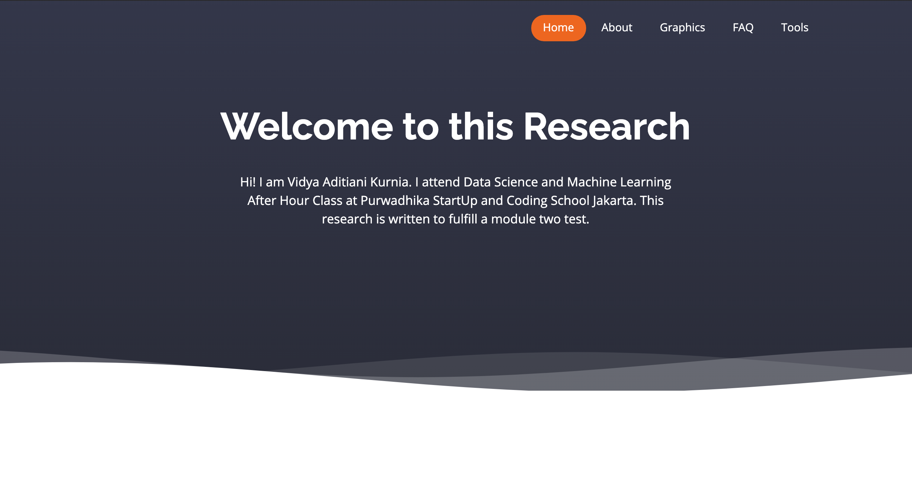
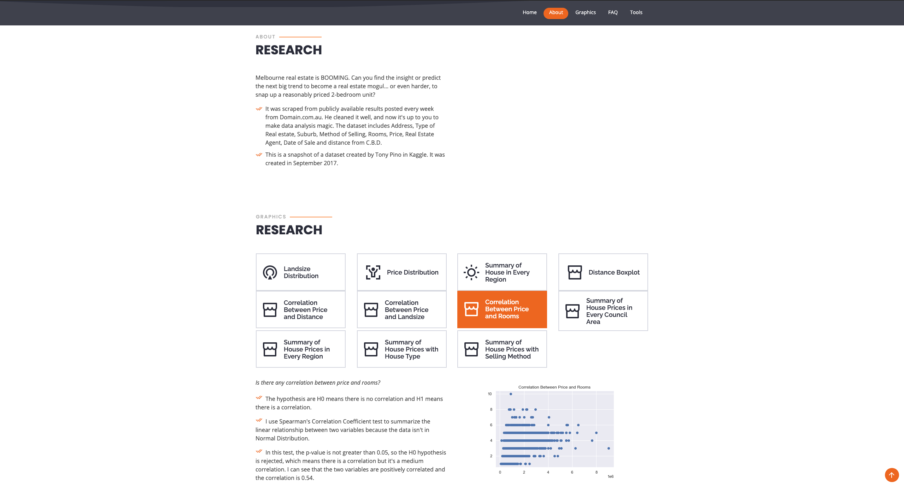
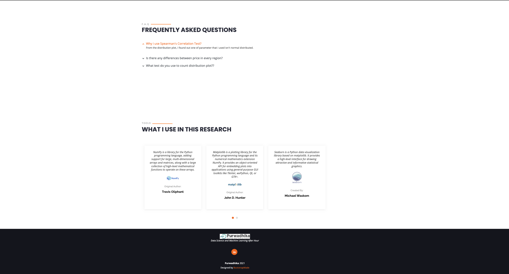

# dashboard-Flask-w-EDA

This is a descriptive analysis data from Kaggle (https://www.kaggle.com/dansbecker/melbourne-housing-snapshot). 
I use Python Programming Language, HTML and Flask for dashboard API.

This is the home page.

It's contains with info, graphics of analysis, and result of statistics.

It's list of tools that I use for the research.

